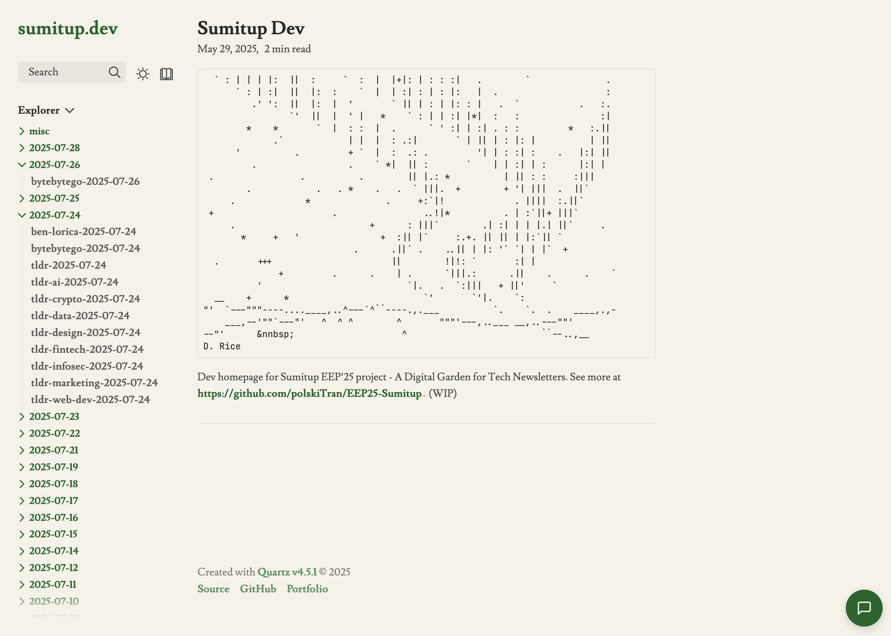
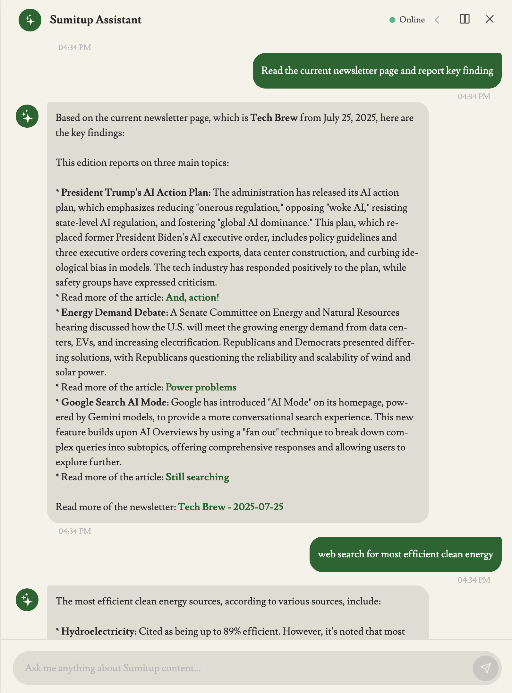
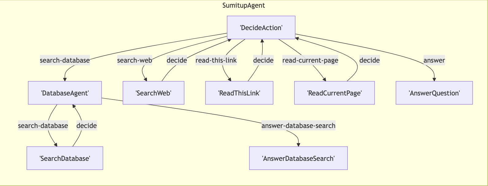

# Sumitup AI Assistant

**Assistant agent for [Sumitup](https://github.com/polskiTran/EEP25-Sumitup)** - Digital tech newsletter garden, [Sumitup web client](https://github.com/polskiTran/Sumitup-quartz-dev)). Built based on [Pocketflow AI Agent framework](https://github.com/The-Pocket/PocketFlow/tree/main/cookbook/pocketflow-tracing).

**Sumitup - Web Client** https://sumitup.dev/ 

**Agent assistant** 


Capable of **searching the internet**, **providing analysis of newsletter database**, **reading provided link**, **current newsletter page** and on sumitup webpage.

# Anatomy

- `nodes.py` - Nodes, can be Agent nodes or tool call nodes.
- `flow.py` - containing the "flow" of the Agent, or graph structure of the Agent.
- `utils/` - containing tool call utilities.
- `server.py` - FastAPI simple websocket server

# Usage

1. Create a `.env` file containing the below keys

```shell
#.env

# Google Gemini - Or LLM provider of choice
GOOGLE_GEMINI_GENAI_API_TOKEN= "..."

# Mongo DB - Newsletter database
MONGODB_URI= "..."

# Tavily Search - Web Search Tool
TAVILY_SEARCH_API_KEY="..."

# Langfuse - GOR DEBUGGING ONLY
LANGFUSE_SECRET_KEY="..."
LANGFUSE_PUBLIC_KEY="..."
LANGFUSE_HOST="https://us.cloud.langfuse.com"
POCKETFLOW_TRACING_DEBUG=true
```

2. Using [UV by Astral](https://docs.astral.sh/uv/) as Python package manager, install the required packages using the below command

```shell
uv sync --lock
```
